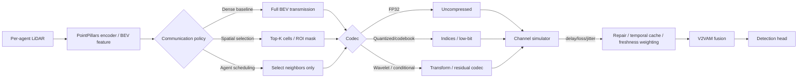

# Improving the V2VAM-Extended PointPillars Intermediate-Fusion Pipeline Under Limited and Lossy V2X Links

## Executive summary

The most important conclusion is that your current direction should treat communication as part of the model, not as an external nuisance. The shared paper, urlVehicular Cooperative Perception Through Action Branching and Federated Reinforcement Learningturn15search1, is not itself a collaborative 3D detection backbone; it is a communication-control paper that asks three infrastructure-level questions jointly: **which neighbor should send**, **which radio resources should be used**, and **what content/resolution should be transmitted** under constrained links. It uses quadtree-compressed sensory messages and an action-branching RL design to make those coupled decisions, then uses federated RL to accelerate policy learning across vehicles. Its main value for your repo is conceptual: it argues that message *selection and resource allocation* should be optimized jointly with perception, rather than assuming all features can always be exchanged. citeturn15search1turn15search14

The V2VAM line of work in your current codebase addresses a different but complementary problem: **robust intermediate fusion under lossy feature transmission**. The V2VAM paper, urlLearning for Vehicle-to-Vehicle Cooperative Perception under Lossy Communicationturn16view0, adds two key modules on top of PointPillars-style intermediate fusion: an LC-aware Repair Network for corrupted feature recovery and a V2V attention module with intra-vehicle attention plus uncertainty-aware inter-vehicle attention. Under their simulated lossy setting, the full V2VAM+LCRN model reaches 84.1/70.5 AP@0.5/0.7 on OPV2V CARLA towns and 84.6/66.3 on Culver City, while several strong intermediate-fusion baselines degrade sharply under loss and can even fall below no-fusion performance. citeturn16view0turn17view1turn17view5turn18view1

Across the 2020–2026 literature, the strongest and most relevant ideas for your codebase cluster into three families. First, **importance-aware selective sharing** methods such as Where2comm, How2comm, COOPERTRIM, and Reason-to-Transmit reduce bandwidth by transmitting only informative spatial regions or agent pairs; these are the easiest drop-in extensions for a V2VAM-style BEV-feature pipeline. Second, **learned compression and codebook methods** such as V2VNet’s learned codec, DiscoNet’s autoencoder compression, CodeFilling, QuantV2X, V2X-DSC, and WaveComm reduce payload size without changing fusion semantics; these are the most direct path to operating below realistic per-frame budgets. Third, **delay/loss-robust methods** such as Latency-Aware Collaborative Perception, V2X-INCOP, Fresh2comm, CoDynTrust, and QPoint2Comm explicitly model stale, missing, or corrupted messages; these are essential if you want the final system to remain useful outside ideal simulation. citeturn25view0turn24view3turn23view0turn22view0turn20view4turn10search3turn32view0turn30view0turn33search0turn21view2turn27view0turn13search3turn20view2turn28view3turn33search2

For your specific starting point, the public implementation appears to be built on urlOpenCOODturn36search0. That repo already contains `point_pillar_intermediate_V2VAM.py`, `fuse_modules/V2VAM.py`, and the config `point_pillar_intermediate_V2VAM.yaml`; its intermediate-fusion dataloader emits `record_len`, `prior_encoding`, `pairwise_t_matrix`, and `spatial_correction_matrix`, which is exactly the information surface needed for budget-aware sampling, delay-aware fusion, and communication simulation. The same repo also benchmarks practical communication under a 27 Mbps transmission assumption and 10 Hz LiDAR, implying a rough budget ceiling of 2.7 Mb per frame if one wants to avoid severe delay. citeturn39view0turn40view1turn41view2turn44view0turn36search0

My recommendation is to run two experiments first. The first should be **importance-guided sparse BEV sharing before V2VAM fusion**, because it is the highest-leverage and lowest-risk change: it preserves your PointPillars backbone, preserves the V2VAM fusion semantics, and is strongly supported by Where2comm, How2comm, and COOPERTRIM. The second should be **codebook or low-bit index transmission for the selected BEV features**, because after you decide *what* to send, the next bottleneck is *how compactly* to send it. That pair of experiments will give you an interpretable rate–distortion frontier for the current repo before you tackle more difficult scheduling and temporal robustness work. citeturn23view2turn22view0turn20view4turn32view0turn30view0turn33search0

## What the shared paper actually does

The shared paper studies cooperative perception from the communication-and-control side, not from the feature-fusion side. Its central question is: under limited V2X resources, **what sensory content should each vehicle share, at what resolution, and with which neighbors**? To answer that, it formulates a joint decision problem over vehicle association, radio resource block allocation, and message content selection. The message itself is built from quadtree-based point-cloud compression, so the controller can choose not just *whether* to send perception content, but also *how fine* the transmitted representation should be. The paper then uses action branching so that this large combinatorial decision can be decomposed into multiple coordinated action branches rather than treated as one monolithic discrete action. citeturn15search1turn1view0

Technically, this means the paper is much closer to a **communication scheduler with perception-aware utility** than to a learned fusion network. The reward is not AP directly; it is a satisfaction-oriented utility reflecting how useful the received sensory information is to vehicles under communication constraints. Federated RL is then introduced so that multiple vehicles can cooperatively train the policy without centralizing all experience as raw data, and the authors report that this improves policy quality within the same training time relative to non-federated learning. The practical lesson for your project is that the “communication policy” can and should be a learned module in its own right. citeturn15search1turn15search14

That paper also makes several assumptions that matter for how you should interpret it relative to your repo. It assumes a structured communication stack with explicit resource allocation and message selection; it uses compressed **raw sensory content** rather than modern BEV feature maps; and it measures success through a communication/perception utility rather than through end-to-end 3D detection AP alone. So it is best viewed as a **policy layer** that could sit on top of a PointPillars/V2VAM backbone, not as a plug-in replacement for your fusion module. In other words: the shared paper tells you how to decide **who sends what**, while V2VAM tells you how to **fuse and repair what arrives**. citeturn15search1turn16view0

That distinction is useful because it clarifies the architectural opportunity in your repo. Right now, most intermediate-fusion baselines assume an almost unconditional exchange of collaborator features. The shared paper suggests lifting that assumption and introducing a learned policy that controls message content and partner selection under explicit rate constraints. For a V2VAM-style system, that policy would naturally operate on BEV importance scores, predicted uncertainty, channel quality, and neighbor utility. That is the cleanest way to transfer the paper’s insight into your codebase. citeturn15search1turn22view0turn23view2

## The state of the art on communication-aware cooperative perception

The literature since 2020 has moved through three broad phases. The first phase established **intermediate fusion** as the practical sweet spot. V2VNet argued that sending compressed intermediate representations balances bandwidth and downstream utility better than raw point clouds or late detections, using a learned variational compression module and ConvGRU-based message passing over spatially aligned BEV features. DiscoNet then improved the performance–bandwidth tradeoff through a teacher–student setup and a trainable collaboration graph, while still allowing aggressive feature-map compression via an autoencoder; notably, DiscoNet(64) achieved 192× less communication volume and still outperformed V2VNet. V2X-ViT and V2VAM belong to the same dense-intermediate family: they share BEV or intermediate feature tensors and then solve the fusion problem with stronger attention mechanisms. citeturn25view0turn25view3turn24view0turn24view3turn19view4turn16view0

The second phase recognized that dense BEV exchange is still too expensive, and shifted to **selective communication**. Where2comm introduced the key idea of a spatial confidence map that identifies where communication is worthwhile. That idea was enormously influential because it showed that one can get more than 100,000× lower communication volume than prior methods on OPV2V and still outperform DiscoNet and V2X-ViT, while a single trained model can be evaluated at different bandwidth budgets. How2comm generalized this idea from purely spatial selection to a **spatial-channel** selection problem, supervised with mutual information objectives and paired with delay compensation; the paper reports markedly better AP–bandwidth tradeoffs than Where2comm and substantial AP@0.7 improvements on DAIR-V2X and OPV2V. COOPERTRIM pushes selection further by using temporal uncertainty both to decide **which** features matter and **how many** should be transmitted at a given instant. Reason-to-Transmit continues in the same direction, but frames communication as a deliberative reasoning problem over scene context, neighbor information gaps, and available budget. citeturn23view0turn23view2turn23view3turn22view0turn22view1turn22view3turn20view4turn10search3

The third phase moved from selective masking into **learned message coding**. CodeFilling introduced codebook-based message representation and demand-filling selection, replacing high-dimensional feature exchange with integer codes and reporting 1,333× and 1,206× lower communication volume than Where2comm on DAIR-V2X and OPV2VH+, respectively. QuantV2X goes even further by quantizing both the model and the transmitted messages, sending code indices rather than FP32 BEV tensors; under deployment-oriented evaluation it reduces system latency by 3.2× and improves mAP30 by 9.5 points on V2X-Real. V2X-DSC revisits collaborative perception from distributed source coding and conditions the receiver on local side information so that only innovation needs to be transmitted, explicitly targeting KB-scale communication. WaveComm offers a different coding perspective by moving to the frequency domain and sending only low-frequency wavelet coefficients, with the receiver reconstructing omitted details by a lightweight generator. These methods are especially attractive for your codebase because they preserve the “intermediate feature fusion” formulation while making transmission compact. citeturn32view0turn30view0turn30view1turn33search0turn21view2

A parallel branch of literature focuses on **non-ideal channels rather than only payload size**. Latency-Aware Collaborative Perception was the first major paper to formulate explicit communication latency in collaborative perception and introduced SyncNet to synchronize delayed feature-level messages. V2X-INCOP addressed communication interruption by predicting missing collaboration information from historical multi-scale spatiotemporal context. Fresh2comm reframed the problem in terms of Age of Information and used freshness-aware optimization for delayed and inconsistent-delay links. CoDynTrust added dynamic trust weighting for asynchronous multi-agent fusion and reports gains under an expected 300 ms interval as well as under pose noise. QPoint2Comm is especially relevant to your topic because it directly targets both severe bandwidth constraints and random packet loss, using quantized point-cloud indices plus masked training to improve loss tolerance. citeturn27view0turn13search3turn20view2turn28view2turn28view3turn33search2

Finally, there is a smaller but important cluster around **scheduling and message-unit redesign**. SchedCP uses DDQN-based user scheduling with both channel-state and semantic information; in its experiments, models are trained under 300 kHz and tested over 200–600 kHz, corresponding to roughly 3.3–11.2 Mbps-like channel capacities depending on strategy. The original shared FRL paper is in this family too, though it operates over quadtree-compressed sensory payloads rather than learned BEV features. On the message-unit side, Point Cluster argues that a good message should be a sparse unit carrying both structure and semantics, while Which2comm sends object-centric semantic detection boxes with temporal encoding. These are intellectually important because they suggest that feature tensors may not always be the right communication primitive, but they are less straightforward to integrate into a V2VAM-style BEV exchange pipeline. citeturn20view1turn35view1turn35view2turn15search1turn20view5turn20view6

## A practical taxonomy and what fits your current repo

The public repo structure is the key reason this project is technically tractable. urlOpenCOODturn36search0 exposes your relevant V2VAM path in `opencood/models/point_pillar_intermediate_V2VAM.py`, the fusion logic in `opencood/models/fuse_modules/V2VAM.py`, and the corresponding YAML config `point_pillar_intermediate_V2VAM.yaml`. At the data layer, `IntermediateFusionDataset` collates `record_len`, `prior_encoding = [velocity, time_delay, infra]`, `pairwise_t_matrix`, and `spatial_correction_matrix`, all of which can be reused for bandwidth simulation, freshness weighting, and conditional message packaging. It also already treats intermediate fusion as a different pathway from early and late fusion, which means communication-specific instrumentation can be added without breaking the entire training stack. citeturn39view0turn40view1turn41view2turn44view0

That repo structure strongly favors methods that **do not change the basic message type too radically**. The best fit is any approach that still sends some form of BEV/intermediate feature map, but with masking, quantization, coding, or delay-aware weighting layered around it. Where2comm, How2comm, COOPERTRIM, CodeFilling, QuantV2X, WaveComm, and V2X-DSC are all compatible with that design philosophy. By contrast, methods that switch to raw-point sparse sampling or object-level semantic messages—such as CoLC, Point Cluster, or Which2comm—are promising, but would require more invasive changes to the sender/receiver interfaces, fusion code, and perhaps the detection head. citeturn23view2turn22view0turn20view4turn32view0turn30view1turn21view2turn33search0turn21view3turn20view5turn20view6

The most important conceptual gap in the current V2VAM baseline is that its “lossy communication” simulator is still quite abstract. In the paper, loss is modeled by randomly selecting portions of the transmitted feature tensor and replacing them with noise, either globally or channel-wise. That is useful as corruption augmentation, but it is not yet a packetized rate-limited channel model with explicit bit budgets, stochastic delay, or bursty erasures. This is exactly where the newer communication-aware literature can improve the repo: add explicit **bit budgets**, **packet drop processes**, **delay/jitter**, and **scheduling decisions** around the BEV message interface rather than only corrupting the tensor after the fact. citeturn18view3turn20view2turn28view2turn33search2

The table below summarizes the most relevant method families for your project. The “expected bandwidth reduction” and “expected accuracy tradeoff” columns should be read as literature-indicated orders of magnitude or typical tendencies, not as directly normalized head-to-head numbers across identical datasets.

| Method family | Fusion level | Data type shared | Compression | Selection policy | Communication model | Expected bandwidth reduction | Expected accuracy tradeoff | Implementation difficulty in `point_pillar_intermediate_V2VAM` | Key references |
|---|---|---|---|---|---|---|---|---|---|
| Dense intermediate BEV | Intermediate | Full BEV / feature maps | Learned compression or none | Usually all neighbors / all cells | Mostly ideal; some delay compensation | Low to moderate | Highest raw AP when links are clean; fragile under strict budgets/loss | Low | V2VNet, DiscoNet, V2VAM citeturn25view0turn24view3turn16view0 |
| Spatially selective sparse BEV | Intermediate | Sparse BEV regions | Masking / sparse packing | Confidence maps, MI-aware filtering, uncertainty, reasoning | Limited bandwidth; some delay-aware variants | High to extreme | Usually very favorable AP–rate tradeoff; can under-share in edge cases | Very high fit | Where2comm, How2comm, COOPERTRIM, R2T citeturn23view0turn22view0turn20view4turn10search3 |
| Codebook / quantized index transmission | Intermediate | Code indices for BEV features | Vector quantization, product quantization, integer codes | Often combined with learned selection | Limited bandwidth; deployment-aware latency | Very high | Small to moderate AP loss at same backbone; sometimes better end-to-end due to lower latency | High fit | CodeFilling, QuantV2X, V2X-DSC citeturn32view0turn30view0turn33search0 |
| Frequency-domain learned codec | Intermediate | Low-frequency feature components | DWT + learned reconstruction | Optional learned packing | Low-bandwidth | High | Graceful degradation if reconstruction works; more sensitive to fine detail loss | Medium fit | WaveComm citeturn21view2 |
| Delay / freshness aware fusion | Intermediate or hybrid | Current + historical features | Usually none or light | Time-weighted, freshness-aware, trust-aware | Delayed, asynchronous, jittered | Low directly; moderate if combined with frame skipping | Large gains under delayed links; little benefit in zero-delay ideal links | Very high fit because dataset already carries delay metadata | Latency-Aware CP, Fresh2comm, CoDynTrust citeturn27view0turn20view2turn28view3 |
| Loss / interruption robust fusion | Intermediate | Corrupted or missing BEV / feature tensors | Repair nets, mask-aware reconstruction | Often implicit in uncertainty/repair module | Packet loss, interruption, corruption | None directly; robustness-oriented | Preserves AP under erasures; may add compute/overhead | Very high fit | V2VAM+LCRN, V2X-INCOP, QPoint2Comm citeturn17view1turn13search3turn33search2 |
| Object-level sparse messages | Late–intermediate hybrid | Detections, object embeddings, semantic boxes | Sparse object coding | Object confidence / object-centric rules | Limited bandwidth, some latency | Very high | Strong efficiency, but may lose scene context important for occlusion reasoning | Medium to low fit | Point Cluster, Which2comm citeturn20view5turn20view6 |
| Sparse early raw-point sharing | Early | Sampled point clouds / pillars | Sampling + reconstruction / completion | Foreground-aware point sampling | Limited bandwidth; heterogeneity-aware | High | Better geometric faithfulness than object-only schemes, but invasive to implement | Low fit for current pipeline | CoLC citeturn21view3 |

A compact way to think about the design space for your repo is the following pipeline split: **select → compress → transmit → repair/realign → fuse**. The literature increasingly improves one or more of those five stages, while the current PointPillars+V2VAM baseline mostly emphasizes the final two.

For this codebase, the highest-payoff insertion points are therefore: the communication policy block before message export, the codec immediately before transmission, and the repair/temporal alignment block immediately before or inside V2VAM fusion. That maps cleanly onto the repo’s existing separation between dataset collation, model wrapper, and fusion module. citeturn39view0turn40view1turn41view2

## Six concrete implementation experiments for `point_pillar_intermediate_V2VAM`

The table below is deliberately prescriptive. The bandwidth and AP numbers are **expected ranges for your codebase**, inferred from the closest published methods and from the repo’s practical communication assumption, rather than guaranteed results. The reference bit budget to keep in mind is the OpenCOOD guideline of roughly 2.7 Mb per frame at 10 Hz under 27 Mbps. citeturn36search0

| Priority | Experiment | Goal | Required code changes / files | Expected bandwidth reduction | Expected AP impact | Evaluation protocol |
|---|---|---|---|---|---|---|
| High | Importance-guided sparse BEV sharing | Learn a per-agent spatial importance map and transmit only top-K BEV cells or thresholded ROIs before V2VAM fusion | Add a light selector head in `opencood/models/point_pillar_intermediate_V2VAM.py`; add sparse pack/unpack and masks in `opencood/models/fuse_modules/V2VAM.py`; add config knobs in `opencood/hypes_yaml/point_pillar_intermediate_V2VAM.yaml`; log sent-cell counts using `record_len` and batch metadata from `IntermediateFusionDataset` | 8×–128× in a conservative first implementation; higher if you also prune the communication graph | Usually near-flat to slightly negative AP@0.7 at moderate K; can improve robustness by suppressing noisy background. Based on Where2comm/How2comm/COOPERTRIM trends | Test at payload budgets {0.25, 0.5, 1.0, 2.0, 2.7} Mb/frame/neighbor; packet drop {0, 5, 10, 20}% Bernoulli; delay {0, 50, 100} ms; report AP@0.5/0.7, bytes/frame, latency/frame, AP-vs-bit curve, selected-cell ratio. citeturn23view2turn22view0turn20view4turn36search0 |
| High | Codebook / low-bit transmission for selected features | Replace FP32 selected feature transmission with code indices or low-bit quantized tokens | Add `codebook_codec.py` or reuse the repo’s compression utilities as a starting point; integrate encode/decode around the transmit side in `point_pillar_intermediate_V2VAM.py`; add codebook losses and bit settings to YAML | Additional 4×–16× over selected sparse features; 16×–64× over dense FP32 BEV in a realistic first pass | Small AP drop if codec is trained end-to-end; often better *system* performance because lower `T_comm` reduces staleness | Same budgets as above, plus ablate codebook size, bits/token, and whether quantization is applied before or after spatial selection; also report end-to-end latency and stale-message fraction. citeturn32view0turn30view0turn30view1turn33search0 |
| High | Explicit packet-loss / burst-loss simulator with mask-aware repair | Move beyond random feature corruption to packetized erasure masks and bursty channel loss; extend receiver repair to use masks and confidence | Extend `IntermediateFusionDataset` to sample channel metadata and carry erasure masks; add channel simulator in the model wrapper before fusion; if your branch already contains LCRN-like repair, extend it; otherwise add a small mask-aware repair block adjacent to `V2VAM.py` | No direct reduction; this is a robustness experiment | The main objective is smaller AP degradation slope under loss; a good target is to remain above no-fusion and degrade gracefully up to 30–50% drop | Bernoulli packet drop {0, 10, 30, 50}% and a burst model such as Gilbert–Elliott; compare random-value replacement vs zero-mask vs learned repair; report AP decay, calibration/uncertainty shift, and reconstruction error on feature tensors. citeturn18view3turn17view1turn13search3turn33search2turn10search3 |
| Medium | Delay-aware temporal cache and freshness-weighted fusion | Reuse stale collaborator messages when new ones are absent, but downweight them by Age of Information and motion-compensate them into the current ego frame | Reuse `time_delay`, `prior_encoding`, `pairwise_t_matrix`, and `spatial_correction_matrix` already emitted by `IntermediateFusionDataset`; add temporal cache logic in the model wrapper; modify V2VAM attention scores to include freshness/trust weighting | 2×–4× if you transmit every 2nd or 3rd frame and rely on cache in between | Typically neutral to mildly negative at low motion, but strongly positive versus the baseline under realistic delays and missing frames | Delay {0, 50, 100, 200, 300} ms; jitter U[0, 20] or U[0, 50] ms; update interval {1, 2, 3} frames; report AP, bytes/sec, AP as a function of message age, and ego-speed-stratified performance. citeturn41view2turn27view0turn20view2turn28view2 |
| Medium | Budgeted neighbor selection / learned communication scheduling | Transmit only from the most useful neighbors under a per-frame bandwidth cap instead of using every available collaborator | Use `record_len` to define candidate neighbors; add channel-quality / distance / overlap metadata to the batch; introduce a small policy head or heuristic gate in `point_pillar_intermediate_V2VAM.py` that masks collaborators before fusion | Roughly linear in selected neighbors: top-1 of 4 gives about 4×, top-2 about 2× | Small AP loss in simple scenes; often positive in crowded scenes when bad collaborators are suppressed | Fixed budgets with varying agent counts {2,3,4,5}; compare nearest-neighbor, max-rate, confidence-gap, and learned scheduler; report AP, bytes, AP-per-bit, and neighbor utility histograms. citeturn15search1turn20view1turn35view1turn35view2 |
| Medium | Conditional residual codec using ego side information | Instead of encoding full collaborator features, encode only the residual innovation not predictable from the ego feature map | Add a sender-side residual/conditional codec and receiver-side conditioned decoder; implement as a plug-in around the current BEV tensor interface so V2VAM itself can remain unchanged | 8×–32× in overlap-heavy scenes; potentially KB-scale under strong overlap | Potentially better than plain quantization at the same bitrate because redundant content is not retransmitted; harder to stabilize | Stratify evaluation by inter-agent overlap and distance; run the same bandwidth and delay grid as above; additionally report reconstruction error vs overlap, and AP gain at fixed bitrate relative to ordinary quantization. citeturn33search0turn32view0turn30view1 |

A few code-level notes follow directly from the repo structure. The **channel simulator** should be inserted after per-agent BEV features are formed and before the cross-agent message enters V2VAM, because this is where the communication artifact actually belongs in an intermediate-fusion architecture. The **dataloader** is the right place to sample or attach channel metadata because it already carries `record_len`, delay-related priors, and pairwise transforms. The **fusion module** is the correct place to consume masks, freshness weights, and uncertainty because that information changes how much the ego should trust each collaborator region. And the **YAML config** should become the single place where bit budgets, drop models, delay models, and codec settings are controlled, so that each paper-inspired variant is reproducible. citeturn41view2turn39view0turn40view1turn44view0

From a research design perspective, the biggest methodological mistake to avoid is mixing too many changes at once. If you simultaneously add sparse selection, quantization, delay handling, and a new fusion rule, you will not know where the gain or loss came from. The clean sequence is: baseline reproduction under ideal links, then explicit channel simulation, then selection, then coding, then temporal robustness, then scheduling. That order mirrors the logic of the literature and gives you an interpretable bandwidth–accuracy–latency frontier instead of a single hard-to-explain result. citeturn16view0turn23view3turn30view0turn27view0

## Recommended roadmap, assumptions, and final recommendation

I am assuming the following because the prompt leaves them unspecified: you can modify the public OpenCOOD-style code path, you can train multiple variants rather than only one final model, you have at least moderate academic GPU access, and the initial target benchmark is LiDAR 3D detection on OPV2V with later transfer to DAIR-V2X or V2X-Real. Those assumptions are consistent with the public repo support for OPV2V/DAIR-V2X/V2X-Real-style datasets and with the presence of a dedicated V2VAM PointPillars config path. citeturn37view0turn44view0

A sensible roadmap is three phases. **Phase one** should take about one to two weeks and only instrument the pipeline: add message-size accounting, explicit channel simulation, and reproducible logging for AP, bytes, and latency under limited bandwidth and lossy communication. **Phase two** should take about three to five weeks and implement the two highest-priority changes: spatially sparse importance-based transmission and then a learned low-bit/codebook codec. This is where you build the first real rate–distortion curve for your repo. **Phase three** should take another four to six weeks and add robustness and policy layers: packet-loss-aware repair, freshness-weighted temporal caching, and finally budgeted neighbor scheduling. The entire program is realistic for one strong student or a small lab pair over a semester if the scope is kept to OPV2V first and if ablation grids are controlled. citeturn36search0turn23view3turn30view0turn27view0

There are also two limitations you should keep in mind before meeting your professor. First, most 2025–2026 methods are still very recent; several are arXiv or OpenReview papers rather than mature canonical baselines, so some performance claims come from authors’ own deployment settings and are not yet standardized across one universal benchmark. Second, the exact details of your private thesis/repo branch could differ from the public OpenCOOD implementation, so the file-level hook suggestions above are highest-confidence where they rely on the public structure—`point_pillar_intermediate_V2VAM.py`, `fuse_modules/V2VAM.py`, and `IntermediateFusionDataset`—and lower-confidence where they assume an already-integrated repair network that may or may not exist in your branch. citeturn39view0turn40view1turn41view2

The two experiments I recommend you run first are these. **First:** add an importance-guided sparse communication layer in front of V2VAM, because this is the cleanest way to import the strongest communication-aware ideas from Where2comm, How2comm, and COOPERTRIM while preserving your current backbone and fusion semantics. **Second:** add a codebook or low-bit transmission layer on top of those selected features, because once the model has learned *what* to send, the next bottleneck is compact representation, and this is where CodeFilling, QuantV2X, and V2X-DSC offer the most directly transferable ideas. If those two work, you will have a publishable bandwidth-aware baseline; if they do not, you will at least know whether your bottleneck is at the selection stage, the codec stage, or the original fusion stage itself. citeturn23view2turn22view0turn20view4turn32view0turn30view0turn33search0